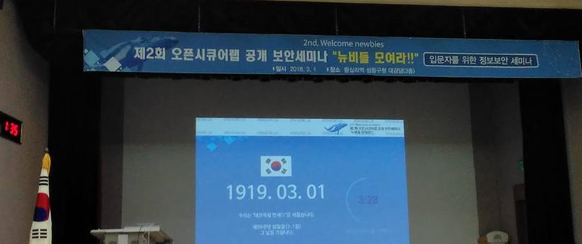

# 제 2회 오픈시큐어랩 공개 보안세미나
> 뉴비들 모여라!<br>
Welcome Newbies!

<br>

# 오픈시큐어랩 소개
새로운 도전 -> 정보보안 교육 -> 보안카페(취준생 취업 멘토링)

## 올바른 보안윤리를 갖춘 정보보호 전문가 양성
스터디 연구회 -> 공개 세미나 -> 교육 -> 출판 -> 보안컨설팅

# TRACK 1
다함께 알아보는 웹 해킹, XXE 인젝션<br>
Team 한입만(류창민, 홍지욱)

### 인젝션의 종류
SQL, OS, XXE, LDAP...
> 입문자 : 솔직히 SQL 인젝션만 들어봤습니다.

## XML이란?
XML : 데이터 상호 교환을 위한 표준 방식

- 도서 구매 홈페이지와 유사하다(상위 목록-하위목록 -> 계층 구조)
- 정보의 표현이 가능하다
- 트리 구조로 자료를 표현

### XXE injection?
XML eXternal Entity

- DTD : 영화 감독 -> 어떤 내용을 어떻게 구성할 것인지 정의
- 엔티티 : 배우 & 스태프 -> 문서에서의 각 구성 내용

1. 내부(internal) 엔티티 : 문서 내부에 정의된 것
2. 외부(external) 엔티티 : 문서 외부 파일에서 가져온 것

## XXE 인젝션 개념
외부 엔티티를 원하는 값으로 변조

## XXE 인섹션 절차
1. 해커 -> 서버 : XML 삽입
2. 서버 : XML 분석 및 실행
3. 해커에게 실행결과 전달

## XXE 인섹션 포인트
- 코드를 입력하는 곳
- 파일 업로드를 통해 넘기는 곳

## XXE injection 발생조건
1. XML
2. REQUEST
3. DTD
4. SYNTAX

## XXE injection 활용 가능 공격
1. 로컬 파일 열람
2. 크로스사이트 스크립팅(XSS)
3. DoS(Denial of Service) : 서버에 과부하를 주는 공격
4. 포트스캐닝

## XXE injection 보안 대책
에러 메시지 출력 x

# TRACK 2
# 메타스플로잇을 이용한 모바일 해킹 - 스마트폰, 사생활은 없다
Just Do It 정병문

## Background Knowledge for Hack

### Metasploit이란 무엇일까?

- 공구 상자 : 여러 도구의 통합체계 -> Metasploit : 보안문제 식별기능, 보안 평가기능, 취약점 완화기능
- 공구 -> Msfvenom

### What is Smishing?
Smishing = SMS + Phishing

### What is Backdoor?
Dev -> security -> security -> security -> System<br>
==============> Banned ====================><br>

악성 프로그램 실행 -> 휴대폰에 백도어가 생성됨

## Let's Hack
실습

## Need what?

- 출처를 알 수 없는 앱 설치 x
- 모바일 백신 -> 환경설정 -> 실시간 감시

## Security Awareness
보다 성숙한 보안 인식 가지기

#Fuzzing으로 찾는 Software 취약점
정원영

## 소프트웨어 버그란?
소프트웨어가 예상한 동작을 하지 않고 crash, 잘못된 결과

## 취약점?
Jailbreak, Rooting -> 권한상승 취약점으로 모바일 디바이스의 루트 권한 따기

#### 왜 취약점 이슈 증가?
- WannaCry(SMB 취약점)
- KRACK (WPA2 취약점)
- 취약점 포상제, 버그바운티

#### How to find it?
- Source Code Auditing (Github)
- Reverse Enginnering
- Fuzzing -> 자동적으로 찾을 수 있음

## Fuzzing
프로그램에 유효하거나 유효하지 않은 값을 무작위로 대입하는 행위
```bash
cat /dev/random | ./program
```
난수를 생성해 프로그램에 입력

### Fuzzing 기법
- Dumb Fuzzing : 아무런 정보 없이 무작위 정보 변형 후 대입
- Smart Fuzzing : 사용자가 지정한 양식을 사용해 대입

### Fuzzing Frameworks

#### Dumb Fuzzer
- AFL (Linux)
- Sulley (Windows)

원본 ==변형==> 결과값

#### Smart Fuzzer
- Peach Fuzzer
- Sloth Fuzzer

양식 ==양식에 맞는 랜덤값==> 결과값

## Finish
Security + AI

# TRACK 3
# 2018년 보안위험 전망 (by MICROTREND)
1. <strong>랜섬웨어</strong> 비즈니스 모델
2. IoT 기기(드론 등) 악용
3. 머신러닝과 <strong>블록체인 기술</strong>을 이용한 회피기법강화
4. 개인정보보호규정을 위한 확실한 조치
5. 애플리케이션과 <strong>플랫폼</strong>의 조작 및 취약점 문제 -> intel Meltdown 취약점 관련 내용

# 워너크라이 랜섬웨어 분석 - 워너크라이 이제 돈 워너크라이
아구튜어라(장서원, 최재혁, 선수민)

## 랜섬웨어 정의
랜섬(몸값)+웨어(소프트웨어)<br>
악의적인 링크를 통해 감염 -> 파일 암호화 -> 암호키를 가지고 금전적인 요구

## 랜섬웨어로 인한 피해
1090억 -> 3000억 (증가)<br>

#### 워너크라이 피해 (1등 : 러시아)
WannaCry = WannaCrypt -> SMB(윈도우의 파일공유 프로토콜) 취약점 이용<br>

#### 워너크라이 전파 원리
감염된 PC에서 IP 대역 스캔 -> SMB 취약점으로 445번 포트로 악성패킷 전달 -> (같은 방법으로 전파)<br>
-> 워너크라이의 특징

## 워너크라이 동작원리

#### 1. 킬 스위치 체크(특정 도메인)
킬 스위치 사용 이유?

1. 랜섬웨어가 제어 불능상태로 폭주하는 것을 방지
2. 보안회사에서의 백신개발을 위한 탐지를 우회하기 위함
3. 해커가 의도한 것이 아닌 자체 취약점

#### 2. 악성파일 생성

1. 리소스(공격자가 공격을 위해 사용하는 파일들) 호출
2. 악성파일 생성 : 암호화에 필요한 키, 주요 동작에 사용되는 파일, 주요 동작을 행하는 파일, 감염사실을 알릴 때 사용하는 파일, 랜섬 노트, 토르 네트워크 관련 파일(IP우회를 위함)
3. 파일 암호화 : 암호화 대상 설정(시스템에 중요한 실행파일 등은 제어 -> 실행에 방해가 될 수 있음)
4. 확장자 변경한 암호화된 파일 생성, 원본 파일 삭제

#### 3. 감염사실 알리고 비트코인 요구
바탕화면을 변경하고 정해진 시간 내에 해커의 주소로 비트코인을 보내라고 요구

#### 4. 암호화 파일 삭제
정해진 시간까지 입금되지 않으면 암호화 파일을 삭제

## 복구 및 예방

- 해독툴을 이용한 복구화
- 모든 소프트웨어 최신상태 유지
- 출처가 불분명한 첨부파일, URL 열람 X
- 주기적인 백업
- 백신 소프트웨어 설치 및 최신버전 유지

# 블록체인, 가상화폐로 끝날 것인가
인력GO(권구윤, 박법석, 박진감)

## 개요
채굴기 = 연산력<br>
블록체인에 연산력을 제공하고 그에 대한 보상으로 가상화폐를 받음

### 블록체인?
- 2009년 사토시 나가모토
- 가상화폐의 실현
- 해쉬함수, linked-list, 전자서명 등의 기술들이 사용

### 블록체인의 원리
- 기존 방식은 모든 정보가 한 곳에 집중
- 은행이 거래 정보를 받아서 기록 및 보관
- 은행이 거래의 신뢰성을 보장
- 은행이 해킹될 경우 모든 장부가 변조될 수 있음

### 블록체인
- 중앙처리기관이 없음
- 전체가 장부를 가지고 있어 신뢰성 유지

## 블록체인의 확장성
- 가상화폐는 블록체인이 화폐에 적용된 모습
- 다른 분야에도 적용 가능
- 여러 분야에서 점진적으로 도입 중

### 블록체인의 확장성 : 물류 관리
- 사기, 오류 근절
- 물리적 낭비 감소
- 인적, 시간적 자원 절약
- 효율적 관리 및 사고나 문제 대응력 향상

### 블록체인의 확장성 : 의료, 보험업계
개인건강기록(PHR) 바탕으로 중복된 검사 X, 효율적, 안전

### 블록체인의 확장성 : 금융권
보안수준, 투자관심 등

## 결론
블록체인 : 가상화폐를 위해 도입되었지만 활용성이 무궁무진하여 우리의 생활 전반에 영향을 줄 기술

# 정보주체가 바라보는 개인정보보호
핵태(박창만)

## 개인정보 개요

### 개인정보의 정의
개인정보보호법, 정보통신망법

1. 살아있는(생존하는) 개인에 관한 정보
2. 특정한 개인을 알아볼 수 있는 정보
3. 다른 정보와 쉽게 결합하여 알아볼 수 있는 정보

정보통신기술의 발달에 따라 범위가 넓어지고 가치가 증가<br>

### 개인정보의 가치

- 개인 : 사적 가치
- 기업 : 상업적 가치
- 국가 : 공적 가치

## 개인정보보호의 양면성

### 기업과 개인의 상반된 개인정보보호 인식
개인정보를 보호해야 하는 이유

1. 개인정보 범위의 확대
2. 개인정보 가치의 향상
3. 유출된 개인정보의 소멸

## 일상 속 개인정보보호

- 수집 목적, 이용약관 미숙지로 인한 문제 -> 개인정보처리방침, 이용약관 확인하는 습관
- SNS 개인정보 게시로 인한 문제 -> 게시할 때 주의, 공개범위 사용
- 안전하지 않은 웹 서비스 이용

## 개인정보보호는 선택이 아닌 필수

# 속수무책 인텔 CPU 보안 결합 분석
당신의 보안이 녹아내리고 있다, 멜트다운

- 스펙터
- 멜트다운(불량데이터 캐시적제 취약점)

## CPU 게이트?
1995년부터 아무도 발견하지 못하고 구글의 프로젝트 제로팀이 얼마전 발견<br>
인텔이 패치 늦게함 -> 마소, 애플, 리눅스에서 패치하다가 리눅스 팀이 취약점 발견<br>
30% 이상 성능저하 발견 -> 인텔 패치(재부팅 오류) -> 다시 패치(SSD 성능 떨어짐)

### 대상
1995년 이후 비순차적 명령어 처리 기술을 적용한 모든 인텔 프로세서(10대 중 7대)

## Meltdown?

### 파이프라인
4가지 기계로 드론을 제작한다고 예시<br>
하나씩 하나씩 드론 만들면서 직렬적으로 동작 -> 생산성을 높일 방법?<br>
-> 1, 2, 3, 4 순서대로 놀고있는 기계 없이 계속 동작시킴 -> 절반 이상 시간절감<br>
> 이게 바로 여러 가지 명령어를 한꺼번에 실행하는 파이프라인

### 비순차적 명령어 실행(Out-of-Order Execution)
다른 명령어와 관련 없는, 의존성이 없는 연산을 빈공간에 끌어다가 처리 -> 효율성 높임

### 하드디스크와 캐시
CPU에게 하드디스크의 100번 데이터를 가져오라고 말함<br>
(하나씩 뒤져봄)<br>
처음 자료를 가져온 뒤 캐시에 저장하고 99번도 가져옴 -> 더 효율적임<br>
캐시 : 하드디스크보다 빠르고 데이터의 재사용을 위해서 저장<br>

-> 위 세 수단은 효율성, 생산성을 높이기 위해 도입됨(그러나 치명적인 취약점이...)

## Meltdown이란?
인공지능이 관리하는 도서관에 비유하면...<br>
권한이 없는 책에 접근하기 위한 권한과 키를 동시에 가져옴<br>
비순차적 과정 -> 그렇기 때문에 키를 가져올 때 책은 책상(캐시 메모리)에 두게 됨<br>
해커는 그 과정을 볼 수 없음<br>

보려면..?<br>

1. 해리포터 책 10권 기부
2. 조사해온 숫자만큼 책을 요청, 4권을 요청
3. 4권 테이블, 권한 체크(해커는 이 과정을 볼 수 없음)
4. 이때 해리포터 책 10권을 요청
5. 테이블에 있던 4권을 주고, 공용서고의 6권을 줌(시간 체크)

-> 4권을 받았으니 비밀서고의 첫 글자는 4라는 것을 추측할 수 있음

# 정보보안이란?
